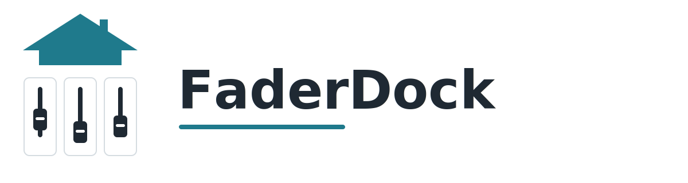

# FaderDock

<p align="center">
  
</p>

<p align="center"><strong>DIY motorized fader kit for smart homes.</strong></p>

<p align="center">
  Physical control for scenes, automations and custom smart home workflows.
</p>

<p align="center">
  <a href="https://faderdock.net">Documentation</a> ·
  <a href="https://github.com/dornieden/faderdock">GitHub</a>
</p>

---

## What is FaderDock?

FaderDock is a DIY motorized fader kit for people who want real, tactile control for their smart home automations, scenes, and custom integrations.

It is designed for makers, tinkerers, and builders who want a polished physical interface without losing the flexibility of an open system.

## Why FaderDock?

- Motorized faders with a clean hardware-focused design
- DIY-friendly project structure
- Tactile control instead of screens only
- Open and flexible for custom integrations
- Clear documentation with a lightweight visual style

## Best for

- makers and tinkerers
- custom smart home setups
- tactile control concepts
- ESP32-based DIY hardware projects
- documentation-first product development

## Documentation

The main documentation lives at:

**https://faderdock.net**

Key sections:

- Project overview
- Open source scope
- FAQ
- Pro build documentation
- Downloads and troubleshooting

## Project status

FaderDock is an active DIY project and product concept.  
The documentation, branding and repository structure are already being prepared in a consistent way.

## Repository structure

```text
docs/        MkDocs documentation
.github/     issue templates, PR template, repo defaults
assets/      visual identity and branding files
```

## Contributing

Ideas, bug reports and feedback are welcome.

Please use the issue templates so reports stay structured and actionable.

